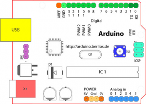
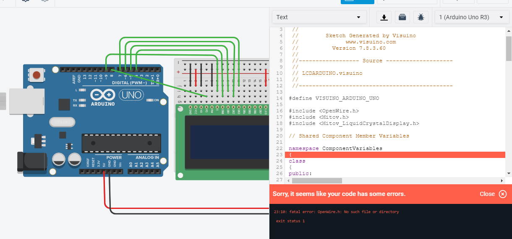
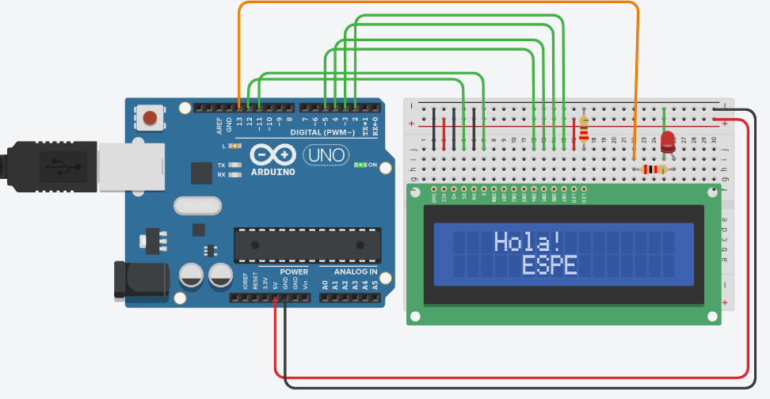
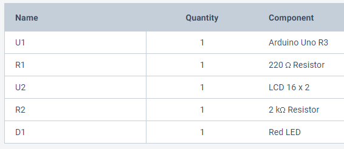
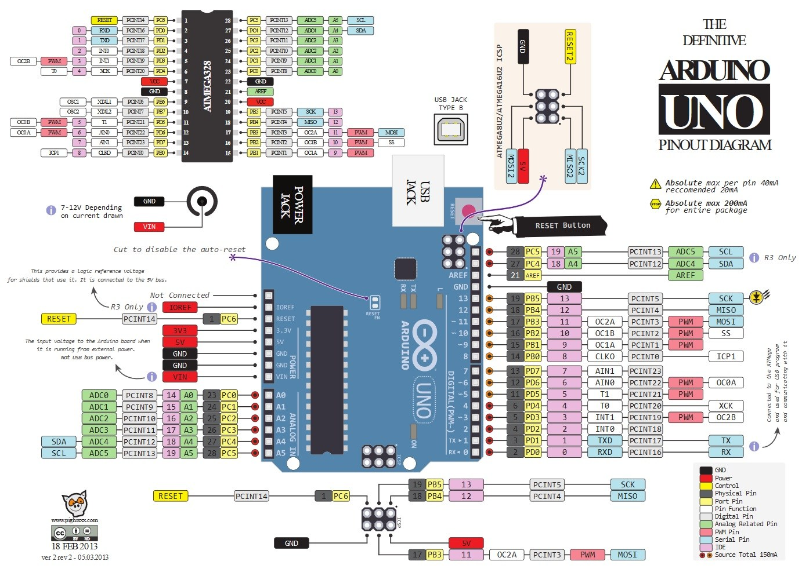
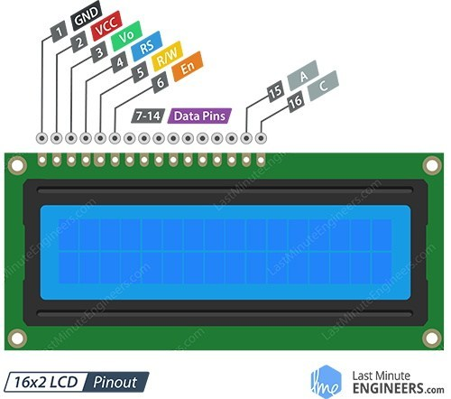

# Informe 

## Tutorial para programación arduino  para controlar un LCD  16x2 en Visuino

### 1.	PLANTEAMIENTO DEL PROBLEMA

Actualmente existen varias plataformas de tarjetas de desarrollo, y algunas de ellas son de hardware y software libre. No obstante, existen otras plataformas las cuales al mismo tiempo de ser de forma libre nos dan como servicio adicional el hecho de ser gratuitas. En este documento se trabajará con Arduino Uno y LCD  16x2 por medio de la plataforma de Visuino.
### 2. OBJETIVOS

General:

●	Implementar circuitos con las tarjetas de desarrollo Arduino Uno y LCD  16x2 por medio de plataformas digitales.
Específicos:

Especificos:

●	Identificar los componentes electrónicos que componen las tarjetas de desarrollo Arduino Uno y LCD  16x2.

●	Conocer las generalidades y funcionamiento las tarjetas de desarrollo Arduino Uno y LCD  16x2

●	Reconocer la escritura y sintaxis de las tarjetas de desarrollo Arduino Uno y LCD  16x2

### 3.	ESTADO DEL ARTE

### Tema: ENTRENADOR PERIFÉRICO DE INTERFAZ BASADO EN EL MICROCONTROLADOR ARDUINO UNO.

Investigadores: Steven Jendri Sokop y Dringhuzen J. Mamahit.

Año: 2016

El desarrollo de la tecnología electrónica hoy en día se está desarrollando muy rápido, y detrás de todo eso hay recursos humanos como desarrolladores de avances en tecnología electrónica.

El entrenador o los medios de enseñanza son herramientas de aprendizaje que se pueden observar a través de los cinco sentidos y como ayudantes en el proceso de aprendizaje para ser más efectivos.

Los accesorios pueden estar en forma de periféricos de interfaz porque en un sistema periférico de interfaz hay herramientas en forma de hardware con software como medio interactivo.

El microcontrolador es una tecnología que se está desarrollando tan rápidamente con varios tipos y funciones, como el Arduino Uno, que se puede utilizar como microcontrolador para diversas funciones en el campo de la tecnología electrónica.

Lugar: Departamento de Ingeniería Eléctrica, Sam Ratulangi University Manado, Indonesia.

### Tema: Automatización del sistema de facturación de equipaje del aeropuerto.

Investigadores: Himank Aggarwal, Mayank Agnihotri, Varun Kumar Kakar  y Kartikey Dubey.

Año:2018

El avión, actualmente el modo de transporte más rápido, es la primera opción para aquellos que desean hacer un largo viaje. Incluso
después del despegue, puede llegar rápidamente a su destino, pero el proceso de prearranque suele llevar mucho tiempo. Como regla general, tenemos problemas
con la medición del peso del equipaje en el check-in en el aeropuerto como el
Las aerolíneas han establecido un límite de peso fijo para nuestro equipaje. A pesar de
La modernidad de la terminal y la arquitectura impresionante, un rápido,
El sistema de manejo de equipaje eficiente y fluido todavía juega un papel
Papel importante en la prestación de un servicio excepcional. Y si tenemos un
sistema automático de facturación de equipaje, todo lo que tiene que hacer es saquear
su boleto y su equipaje serán registrados a su nombre
y el cargo extra por su equipaje será automáticamente
publicado, si lo hay. En este artículo, presentamos un modelo de sistema
diseñado para automatizar el sistema de registro de equipaje de vuelo mediante
tratando de crear una solución fácil de usar, rentable y eficiente
sistema de autocomprobación.

Lugar: Instituto de Aplicaciones y Gestión Informática de Bharati Vidyapeeth (BVICAM), Nueva Delhi (INDIA).

### 4.	MARCO TEÓRICO
Gracias a las nuevas plataformas que se han creado, los desarrolladores han podido manejar el desarrollo y diseño de distintos proyectos con una mayor rapidez y eficiencia en lo que son los diferentes procesos que estos conllevan. Actualmente la adquisición de dichas plataformas sea vuelto mucho más fácil y barato, al punto de llegar a utilizar algunas plataformas de manera gratuita.
También en otro apartado de lo que se refiere hardware, los controladores como lo son los Arduinos Uno son los más utilizados por sus cualidades al momento de programarlos ya que su programación es estándar y eso ayuda a muchos desarrolladores al momento de generar interfaces para cualquier dispositivo.
Tinkercar es una plataforma online brindada por Autodesk, una de sus principales características es el hecho de poder utilizarla de forma gratuita, antes de ello es esencial la creación de una cuenta de dicha plataforma. Existen varios servicios que nos provee la plataforma por el que se la conoce en todo el mundo principalmente es ser una herramienta para el diseño de piezas en 3D, pero en este documento nos centraremos en otro servicio que igualmente ofrece la plataforma es cuál es la posibilidad de simular circuitos electrónicos como también el hecho de poder programar los mismos, especialmente en Arduino (Vidal-Silva, C., Lineros, M. I., Uribe, G. E., & Olmos, C. J. ,2019).
Tinkercad unifica un lenguaje de programación estructurado y componentes electrónicos compatibles con Arduino para poder generar un ecosistema el cual sea ideal para la programación y creación de soluciones tecnológicas.

#### Arduino UNO

ARDUINO UNO es un microcontrolador el cual está basado en ATMega 328P. Tiene 14 entradas/salidas digitales, de las cuales 6 se pueden utilizar como salidas PWM (Modulación por ancho de pulsos) y otras 6 son entradas analógicas.Entre una de sus variadas características se destaca una biblioteca la cual sirve para poder controlar servomotores desde 0 y 180 ◦ . Los servos de rotación continua permiten varias velocidades de rotación de los ejes (Sánchez, 2012).
Conectores de la tarjeta de Arduino UNO.

1.	Terminal de referencia analógica (naranja)
2.	Tierra digital (verde claro)
3.	Terminales digitales 2-13 (verde)
4.	Terminales digitales 0-1/ E/S serie – TX/RX (verde oscuro) – Estos pines no se pueden utilizar como e/s digitales (digitalRead() y digitalWrite()).Botón de reinicio – S1 (azul oscuro)
5.	Programador serie en circuito «In-circuit Serial Programmer» o «ICSP» (azul celeste). Terminales de entrada analógica 0-5 (azul claro)
6.	Terminales de alimentación y tierra (alimentación: naranja, tierras: naranja claro)
7.	Entrada de alimentación externa (9-12VDC) – X1 (rosa)
8.	Selector de alimentación externa o por USB – SV1 (púrpura). En las versiones nuevas de Arduino la selección de alimentación es automática por lo que puede que no tengas este selector.
9.	USB (utilizado para subir programas a la placa y para comunicaciones serie entre la placa y el ordenador; puede utilizarse como alimentación de la placa) (amarillo)

#### Visuino

Visuino es un ambiente de programación basado en la tecnología Open Wire, en donde todo es conectado por una serie de diagramas y pines, así consigues tener un diseño de tu circuito electrónico con su correspondiente código para grabarlo en Arduino.

En otras palabras com visuino podemos hacer  un circuito electrónico con los componentes disponibles como lo son los displays, leds, botones, etc. eEntonces Visuino te crea el código para que el circuito te funcione, con tu placa de Arduino.

#### LCD
El LCD(Liquid Crystal Dysplay) o pantalla de cristal líquido es un dispositivo empleado para la visualización de contenidos o información de una forma gráfica, mediante caracteres, símbolos o pequeños dibujos dependiendo del modelo. Está gobernado por un microcontrolador el cual dirige todo su funcionamiento.
En este caso vamos a emplear un LCD de 16x2, esto quiere decir que dispone de 2 filas de 16 caracteres cada una. Los píxeles de cada símbolo o carácter, varían en función de cada modelo.

La pantalla LCD tiene 16 pines de conexión, numerados del 1 al 16 de izquierda a derecha.

### 5.	DIAGRAMAS

### 6.	LISTA DE COMPONENTES

●	Computador

●	Plataforma Visuino

●	Internet

### 7.	MAPA DE VARIABLES

Void: Lo utilizamos para la declaración de funciones sin valor de retorno.
 

### 8.- EXPLICACIÓN DEL CÓDIGO FUENTE

### 9.- DESCRIPCIÓN DE PRERREQUISITOS Y CONFIGURACIÓN

### 11.	RECOMENDACIONES

### 12.	BIBLIOGRAFÍA

●	Sánchez, E. (2012). Diseño de un sistema de control domótico basado en la plataforma Arduino. Master's thesis. Escuela Técnica Superior de Ingeniería Informática. Universidad Politécnica de Valencia.

●	C. Vidal, C. Cabezas, J. Parra y L. López, (S.F.) “Experiencias prácticas con el uso del lenguaje de programación Scratch para desarrollar el pensamiento algorítmico de estudiantes en Chile " Formación Universitaria, vol. 8, págs. 23–32, 2015. [En línea]. Disponible: http://www.redalyc.org/articulo.oa?id=373544191001

●	 European-Schoolnet, (2015) Calculando nuestro futuro: programación informática y Codificación de prioridades, programas escolares e iniciativas en toda Europa. Bruselas, Bélgica.

●	Vidal-Silva, C., Lineros, M. I., Uribe, G. E., & Olmos, C. J. (2019). Electrónica para Todos con el Uso de Arduino: Experiencias Positivas en la Implementación de Soluciones Hardware-Software. Información tecnológica, 30(6), 377-386.

### 13.	ANEXOS

### 14. MANUAL DE USUARIO

       

### 15. HOJAS TÉCNICAS

