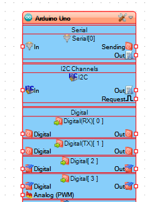
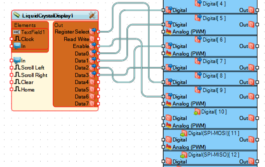
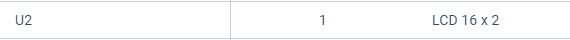

# Informe 

## Tutorial para programación arduino  para controlar un LCD  16x2 en Visuino

### 1.	PLANTEAMIENTO DEL PROBLEMA

Actualmente existen varias plataformas de tarjetas de desarrollo, y algunas de ellas son de hardware y software libre. No obstante, existen otras plataformas las cuales al mismo tiempo de ser de forma libre nos dan como servicio adicional el hecho de ser gratuitas, como lo es el programa VISUINO. En este documento se trabajará con Arduino Uno y LCD  16x2 por medio del programa VISUINO. 

### 2. OBJETIVOS

General:

●	Implementar un circuito con las tarjetas de desarrollo Arduino Uno y LCD  16x2 por medio del programa VISUINO. 
Específicos:

Especificos:

●	Identificar los componentes electrónicos que componen las tarjetas de desarrollo Arduino Uno y LCD  16x2.

●	Conocer las generalidades y funcionamiento las tarjetas de desarrollo Arduino Uno y LCD  16x2

### 3.	ESTADO DEL ARTE

### Tema: Diseño e implementación de un entorno de desarrollo integrado para programación visual de aplicaciones en la generación del Internet de las Cosas

Investigadores: Quiles Alemañ, José.

Año: 	2020

La presente tesis de maestría está directamente alineada con el proyecto bIoTope, financiado por la Unión Europea, que tiene como objetivo construir un ecosistema de innovación abierta de Internet de las cosas (IoT) que permita a las empresas crear fácilmente sistemas de IoT con una inversión mínima. Para contribuir a la consecución de este ambicioso objetivo, en esta tesis, se lleva a cabo una implementación de un entorno de desarrollo integrado (IDE) en una aplicación ampliamente utilizada para conectar objetos inteligentes y obtener información de ellos, conocida como Node-RED.

Para hacer esto posible, se realiza un estudio en profundidad de los diferentes conceptos y tecnologías necesarios en el conjunto de etapas de desarrollo: Definición, Creación de un entorno de desarrollo de Python basado en Skulpt e Implementación con Node-RED. Una vez que se completa la implementación, el nuevo entorno se utiliza y se prueba en diferentes escenarios, como la mitigación de la ola de calor en el Gran Lyon o un posible sistema de estacionamiento inteligente para la Copa Mundial de la FIFA de Qatar 2022, por lo que es posible analizar el resultados y sacar conclusiones positivas, porque a pesar de la existencia de limitaciones, se logra un nuevo entorno que facilita a los usuarios la creación de sistemas IoT, así como el proyecto bIoTope sienta sus bases.

Lugar: 	Universitat Politècnica de València.España.

### 4.	MARCO TEÓRICO

#### Arduino UNO

ARDUINO UNO es un microcontrolador el cual está basado en ATMega 328P. Tiene 14 entradas/salidas digitales, de las cuales 6 se pueden utilizar como salidas PWM (Modulación por ancho de pulsos) y otras 6 son entradas analógicas.Entre una de sus variadas características se destaca una biblioteca la cual sirve para poder controlar servomotores desde 0 y 180 ◦ . Los servos de rotación continua permiten varias velocidades de rotación de los ejes (Sánchez, 2012).
Conectores de la tarjeta de Arduino UNO.

1.	Terminal de referencia analógica (naranja)
2.	Tierra digital (verde claro)
3.	Terminales digitales 2-13 (verde)
4.	Terminales digitales 0-1/ E/S serie – TX/RX (verde oscuro) – Estos pines no se pueden utilizar como e/s digitales (digitalRead() y digitalWrite()).Botón de reinicio – S1 (azul oscuro)
5.	Programador serie en circuito «In-circuit Serial Programmer» o «ICSP» (azul celeste). Terminales de entrada analógica 0-5 (azul claro)
6.	Terminales de alimentación y tierra (alimentación: naranja, tierras: naranja claro)
7.	Entrada de alimentación externa (9-12VDC) – X1 (rosa)
8.	Selector de alimentación externa o por USB – SV1 (púrpura). En las versiones nuevas de Arduino la selección de alimentación es automática por lo que puede que no tengas este selector.
9.	USB (utilizado para subir programas a la placa y para comunicaciones serie entre la placa y el ordenador; puede utilizarse como alimentación de la placa) (amarillo)

#### Lenguaje Gráfico de programación

El lenguaje gráfico es aquel tipo de comunicación que usa gráficos, imágenes y expresiones matemáticas para expresar y transmitir pensamientos o ideas.

El dibujo, específicamente, las pinturas rupestres del Paleolítico Superior, destaca como uno los primeros intentos del hombre para trascender por medio de este tipo de lenguaje. 

Tras éstas manifestaciones prehistóricas y en la medida que fue evolucionando, el hombre buscó formas más avanzadas para comunicarse. En esta búsqueda, pudo perfeccionar tanto el idioma hablado como el escrito. Sin embargo, siempre recurrió al lenguaje gráfico para expresar las ideas más complejas.

Y finalmente, con el avance de la computación y la cibernética, este tipo de lenguaje se ha transformado en la interfase para aplicaciones de videojuegos y otras especialidades informáticas.

#### Visuino

Visuino es un ambiente de programación basado en la tecnología Open Wire, en donde todo es conectado por una serie de diagramas y pines, así consigues tener un diseño de tu circuito electrónico con su correspondiente código para grabarlo en Arduino.

En otras palabras com visuino podemos hacer  un circuito electrónico con los componentes disponibles como lo son los displays, leds, botones, etc. eEntonces Visuino te crea el código para que el circuito te funcione, con tu placa de Arduino.

 

#### LCD
El LCD(Liquid Crystal Dysplay) o pantalla de cristal líquido es un dispositivo empleado para la visualización de contenidos o información de una forma gráfica, mediante caracteres, símbolos o pequeños dibujos dependiendo del modelo. Está gobernado por un microcontrolador el cual dirige todo su funcionamiento.
En este caso vamos a emplear un LCD de 16x2, esto quiere decir que dispone de 2 filas de 16 caracteres cada una. Los píxeles de cada símbolo o carácter, varían en función de cada modelo.

La pantalla LCD tiene 16 pines de conexión, numerados del 1 al 16 de izquierda a derecha.

### 5.	DIAGRAMAS

### 6.	LISTA DE COMPONENTES

●	Computador

●	Plataforma Visuino

●	Internet

### 7.	MAPA DE VARIABLES

ComponentVariables

public:
  uint32_t Value1 : 5;
  uint32_t Value2 : 2;
 

### 8.- EXPLICACIÓN DEL CÓDIGO FUENTE
<pre>

 &#47;&#47;----------------------------------------------
 &#47;&#47;
 &#47;&#47; &nbsp;&nbsp;&nbsp;&nbsp;&nbsp;&nbsp;&nbsp;Sketch Generated by Visuino
 &#47;&#47; &nbsp;&nbsp;&nbsp;&nbsp;&nbsp;&nbsp;&nbsp;&nbsp;&nbsp;&nbsp;&nbsp;&nbsp;&nbsp;<u>www.visuino.com</u>
 &#47;&#47; &nbsp;&nbsp;&nbsp;&nbsp;&nbsp;&nbsp;&nbsp;&nbsp;&nbsp;Version 7.8.3.60
 &#47;&#47;
 &#47;&#47;------------------ Source --------------------
 &#47;&#47;
 &#47;&#47; LCDARDUINO.visuino
 &#47;&#47;
 &#47;&#47;----------------------------------------------

#define VISUINO_ARDUINO_UNO

#include &lt;OpenWire.h&gt;
#include &lt;Mitov.h&gt;
#include &lt;Mitov_LiquidCrystalDisplay.h&gt;

&#47;&#47; Shared Component Member Variables

namespace ComponentVariables
{
class
{
public:
 &nbsp;uint32_t Value1 : 5;
 &nbsp;uint32_t Value2 : 2;

} BitFields;

class Variable1
{
public:
 &nbsp;inline static uint32_t GetValue() { return BitFields.Value1; }
 &nbsp;inline static void SetValue( uint32_t AValue ) { BitFields.Value1 = AValue; }

};
class Variable2
{
public:
 &nbsp;inline static uint32_t GetValue() { return BitFields.Value2; }
 &nbsp;inline static void SetValue( uint32_t AValue ) { BitFields.Value2 = AValue; }

};
} &#47;&#47; ComponentVariables

&#47;&#47; Arduino Constant Declarations

namespace VisuinoConstants
{
class TextValue0
{
public:
 &nbsp;&nbsp;&nbsp;inline static constexpr const char *GetValue() { return &#34;Hola Mundo&#34;; }
};

} &#47;&#47; VisuinoConstants

&#47;&#47; Declarations

namespace Declarations
{
Mitov::LiquidCrystalDisplay&lt;
 &nbsp;Mitov::LiquidCrystalDisplayParallel&lt;
 &nbsp;Mitov::LiquidCrystalDisplayParallel4DataPins&lt;Mitov::DigitalPin_DirectBoardPinImplementation&lt;4 &gt;, Mitov::DigitalPin_DirectBoardPinImplementation&lt;5 &gt;, Mitov::DigitalPin_DirectBoardPinImplementation&lt;6 &gt;, Mitov::DigitalPin_DirectBoardPinImplementation&lt;7 &gt;&gt;, &#47;&#47; 1_PINS
 &nbsp;Mitov::DigitalPin_DirectBoardPinImplementation&lt;8 &gt;, &#47;&#47; 1_PINS_0
 &nbsp;Mitov::DigitalPin_NoImplementation&lt;1 &gt;, &#47;&#47; 1_PINS_1
 &nbsp;Mitov::DigitalPin_DirectBoardPinImplementation&lt;9 &gt;, &#47;&#47; 1_PINS_2
 &nbsp;Mitov::ConstantProperty&lt;21, bool, false &gt;, &#47;&#47; AutoScroll
 &nbsp;Mitov::ConstantProperty&lt;24, bool, false &gt;, &#47;&#47; Blink
 &nbsp;Mitov::ConstantProperty&lt;20, bool, true &gt;, &#47;&#47; Enabled
 &nbsp;Mitov::ConstantProperty&lt;25, bool, false &gt;, &#47;&#47; Hight10Pixels
 &nbsp;Mitov::ConstantProperty&lt;22, bool, false &gt;, &#47;&#47; RightToLeft
 &nbsp;Mitov::ConstantProperty&lt;23, bool, false &gt; &#47;&#47; ShowCursor
 &nbsp;&gt;, &#47;&#47; 0_TYPE
 &nbsp;16, &#47;&#47; Columns
 &nbsp;Mitov::TypedVariable&lt;38, uint32_t, ::ComponentVariables::Variable2&gt;, &#47;&#47; FCursorLine
 &nbsp;Mitov::TypedVariable&lt;32, uint32_t, ::ComponentVariables::Variable1&gt;, &#47;&#47; FCursorPos
 &nbsp;2 &#47;&#47; Rows
 &nbsp;&nbsp;&gt; _o_LiquidCrystalDisplay1;

Mitov::LiquidCrystalElementTextField&lt;
 &nbsp;&nbsp;&nbsp;Mitov::LiquidCrystalDisplay&lt;
 &nbsp;&nbsp;&nbsp;&nbsp;&nbsp;Mitov::LiquidCrystalDisplayParallel&lt;
 &nbsp;&nbsp;&nbsp;&nbsp;&nbsp;Mitov::LiquidCrystalDisplayParallel4DataPins&lt;Mitov::DigitalPin_DirectBoardPinImplementation&lt;4 &gt;, Mitov::DigitalPin_DirectBoardPinImplementation&lt;5 &gt;, Mitov::DigitalPin_DirectBoardPinImplementation&lt;6 &gt;, Mitov::DigitalPin_DirectBoardPinImplementation&lt;7 &gt;&gt;, &#47;&#47; 1_PINS
 &nbsp;&nbsp;&nbsp;&nbsp;&nbsp;Mitov::DigitalPin_DirectBoardPinImplementation&lt;8 &gt;, &#47;&#47; 1_PINS_0
 &nbsp;&nbsp;&nbsp;&nbsp;&nbsp;Mitov::DigitalPin_NoImplementation&lt;1 &gt;, &#47;&#47; 1_PINS_1
 &nbsp;&nbsp;&nbsp;&nbsp;&nbsp;Mitov::DigitalPin_DirectBoardPinImplementation&lt;9 &gt;, &#47;&#47; 1_PINS_2
 &nbsp;&nbsp;&nbsp;&nbsp;&nbsp;Mitov::ConstantProperty&lt;21, bool, false &gt;, &#47;&#47; AutoScroll
 &nbsp;&nbsp;&nbsp;&nbsp;&nbsp;Mitov::ConstantProperty&lt;24, bool, false &gt;, &#47;&#47; Blink
 &nbsp;&nbsp;&nbsp;&nbsp;&nbsp;Mitov::ConstantProperty&lt;20, bool, true &gt;, &#47;&#47; Enabled
 &nbsp;&nbsp;&nbsp;&nbsp;&nbsp;Mitov::ConstantProperty&lt;25, bool, false &gt;, &#47;&#47; Hight10Pixels
 &nbsp;&nbsp;&nbsp;&nbsp;&nbsp;Mitov::ConstantProperty&lt;22, bool, false &gt;, &#47;&#47; RightToLeft
 &nbsp;&nbsp;&nbsp;&nbsp;&nbsp;Mitov::ConstantProperty&lt;23, bool, false &gt; &#47;&#47; ShowCursor
 &nbsp;&nbsp;&nbsp;&nbsp;&nbsp;&gt;, &#47;&#47; 0_TYPE
 &nbsp;&nbsp;&nbsp;&nbsp;&nbsp;16, &#47;&#47; Columns
 &nbsp;&nbsp;&nbsp;&nbsp;&nbsp;Mitov::TypedVariable&lt;38, uint32_t, ::ComponentVariables::Variable2&gt;, &#47;&#47; FCursorLine
 &nbsp;&nbsp;&nbsp;&nbsp;&nbsp;Mitov::TypedVariable&lt;32, uint32_t, ::ComponentVariables::Variable1&gt;, &#47;&#47; FCursorPos
 &nbsp;&nbsp;&nbsp;&nbsp;&nbsp;2 &#47;&#47; Rows
 &nbsp;&nbsp;&nbsp;&nbsp;&nbsp;&nbsp;&gt;, &#47;&#47; 0_TYPE_OWNER
 &nbsp;&nbsp;&nbsp;Declarations::_o_LiquidCrystalDisplay1, &#47;&#47; 1_NAME_OWNER
 &nbsp;&nbsp;&nbsp;Mitov::ConstantProperty&lt;5, bool, true &gt;, &#47;&#47; AllignLeft
 &nbsp;&nbsp;&nbsp;Mitov::ConstantProperty&lt;7, uint32_t, 0 &gt;, &#47;&#47; Column
 &nbsp;&nbsp;&nbsp;Mitov::ConstantProperty&lt;6, char, &#39; &#39; &gt;, &#47;&#47; FillCharacter
 &nbsp;&nbsp;&nbsp;Mitov::ConstantPropertyString&lt;3, ::VisuinoConstants::TextValue0 &gt;, &#47;&#47; InitialValue
 &nbsp;&nbsp;&nbsp;Mitov::ConstantProperty&lt;8, uint32_t, 0 &gt;, &#47;&#47; Row
 &nbsp;&nbsp;&nbsp;Mitov::ConstantProperty&lt;4, uint32_t, 16 &gt; &#47;&#47; Width
 &nbsp;&nbsp;&nbsp;&nbsp;&gt; TArduinoLiquidCrystalElementTextField1;

} &#47;&#47; Declarations

namespace ComponentsHardware
{
void SystemUpdateHardware()
{
}
} &#47;&#47; ComponentsHardware

&#47;&#47;The setup function is called once at startup of the sketch
void setup()
{
 &nbsp;Declarations::_o_LiquidCrystalDisplay1.SystemInit();
 &nbsp;Declarations::TArduinoLiquidCrystalElementTextField1.SystemStart();

 &nbsp;OpenWire::SystemStarted();
}

&#47;&#47; The loop function is called in an endless loop
void loop()
{
}

</pre>

### 9.- DESCRIPCIÓN DE PRERREQUISITOS Y CONFIGURACIÓN

VISUINO

Para poder visualeizar el texto del codigo necesitaremso descargar adicionalmente la aplicación ARDUINO IDE, el cual se vinculara automaticamente a la aplicacion visuino.

### 10. Aportaciones

### 11.	RECOMENDACIONES

Se recomienda tener tener espacio suficiente para poder instalar el programa VISUINO, también en interactuar regularmente con el programa para poder conocer los diferentes componentes que nos brinda.

### 12.	BIBLIOGRAFÍA

●	Sánchez, E. (2012). Diseño de un sistema de control domótico basado en la plataforma Arduino. Master's thesis. Escuela Técnica Superior de Ingeniería Informática. Universidad Politécnica de Valencia.

●	C. Vidal, C. Cabezas, J. Parra y L. López, (S.F.) “Experiencias prácticas con el uso del lenguaje de programación Scratch para desarrollar el pensamiento algorítmico de estudiantes en Chile " Formación Universitaria, vol. 8, págs. 23–32, 2015. [En línea]. Disponible: http://www.redalyc.org/articulo.oa?id=373544191001

●	 European-Schoolnet, (2015) Calculando nuestro futuro: programación informática y Codificación de prioridades, programas escolares e iniciativas en toda Europa. Bruselas, Bélgica.

●	Vidal-Silva, C., Lineros, M. I., Uribe, G. E., & Olmos, C. J. (2019). Electrónica para Todos con el Uso de Arduino: Experiencias Positivas en la Implementación de Soluciones Hardware-Software. Información tecnológica, 30(6), 377-386.

### 13. MANUAL DE USUARIO

       

### 15. HOJAS TÉCNICAS

