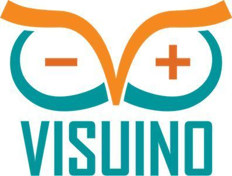

# Informe 

## Tutorial para programación arduino  para controlar un LCD  16x2 en Visuino

### 1.	PLANTEAMIENTO DEL PROBLEMA

Actualmente existen varias plataformas de tarjetas de desarrollo, y algunas de ellas son de hardware y software libre. No obstante, existen otras plataformas las cuales al mismo tiempo de ser de forma libre nos dan como servicio adicional el hecho de ser gratuitas. En este documento se trabajará con Arduino Uno y LCD  16x2 por medio de la plataforma de Visuino.
### 2. OBJETIVOS

General:

●	Implementar circuitos con las tarjetas de desarrollo Arduino Uno y LCD  16x2 por medio de plataformas digitales.
Específicos:

Especificos:

●	Identificar los componentes electrónicos que componen las tarjetas de desarrollo Arduino Uno y LCD  16x2.

●	Conocer las generalidades y funcionamiento las tarjetas de desarrollo Arduino Uno y LCD  16x2

●	Reconocer la escritura y sintaxis de las tarjetas de desarrollo Arduino Uno y LCD  16x2

### 3.	ESTADO DEL ARTE

### Tema: 

Investigadores: 

Año: 

Lugar: 
### Tema: 

Investigadores: 

Año:

Lugar: 

### 4.	MARCO TEÓRICO

#### Arduino UNO

ARDUINO UNO es un microcontrolador el cual está basado en ATMega 328P. Tiene 14 entradas/salidas digitales, de las cuales 6 se pueden utilizar como salidas PWM (Modulación por ancho de pulsos) y otras 6 son entradas analógicas.Entre una de sus variadas características se destaca una biblioteca la cual sirve para poder controlar servomotores desde 0 y 180 ◦ . Los servos de rotación continua permiten varias velocidades de rotación de los ejes (Sánchez, 2012).
Conectores de la tarjeta de Arduino UNO.

1.	Terminal de referencia analógica (naranja)
2.	Tierra digital (verde claro)
3.	Terminales digitales 2-13 (verde)
4.	Terminales digitales 0-1/ E/S serie – TX/RX (verde oscuro) – Estos pines no se pueden utilizar como e/s digitales (digitalRead() y digitalWrite()).Botón de reinicio – S1 (azul oscuro)
5.	Programador serie en circuito «In-circuit Serial Programmer» o «ICSP» (azul celeste). Terminales de entrada analógica 0-5 (azul claro)
6.	Terminales de alimentación y tierra (alimentación: naranja, tierras: naranja claro)
7.	Entrada de alimentación externa (9-12VDC) – X1 (rosa)
8.	Selector de alimentación externa o por USB – SV1 (púrpura). En las versiones nuevas de Arduino la selección de alimentación es automática por lo que puede que no tengas este selector.
9.	USB (utilizado para subir programas a la placa y para comunicaciones serie entre la placa y el ordenador; puede utilizarse como alimentación de la placa) (amarillo)

#### Lenguaje Gráfico de programación

El lenguaje gráfico es aquel tipo de comunicación que usa gráficos, imágenes y expresiones matemáticas para expresar y transmitir pensamientos o ideas.

El dibujo, específicamente, las pinturas rupestres del Paleolítico Superior, destaca como uno los primeros intentos del hombre para trascender por medio de este tipo de lenguaje. 

Tras éstas manifestaciones prehistóricas y en la medida que fue evolucionando, el hombre buscó formas más avanzadas para comunicarse. En esta búsqueda, pudo perfeccionar tanto el idioma hablado como el escrito. Sin embargo, siempre recurrió al lenguaje gráfico para expresar las ideas más complejas.

Y finalmente, con el avance de la computación y la cibernética, este tipo de lenguaje se ha transformado en la interfase para aplicaciones de videojuegos y otras especialidades informáticas.

#### Visuino

Visuino es un ambiente de programación basado en la tecnología Open Wire, en donde todo es conectado por una serie de diagramas y pines, así consigues tener un diseño de tu circuito electrónico con su correspondiente código para grabarlo en Arduino.

En otras palabras com visuino podemos hacer  un circuito electrónico con los componentes disponibles como lo son los displays, leds, botones, etc. eEntonces Visuino te crea el código para que el circuito te funcione, con tu placa de Arduino.

 

#### LCD
El LCD(Liquid Crystal Dysplay) o pantalla de cristal líquido es un dispositivo empleado para la visualización de contenidos o información de una forma gráfica, mediante caracteres, símbolos o pequeños dibujos dependiendo del modelo. Está gobernado por un microcontrolador el cual dirige todo su funcionamiento.
En este caso vamos a emplear un LCD de 16x2, esto quiere decir que dispone de 2 filas de 16 caracteres cada una. Los píxeles de cada símbolo o carácter, varían en función de cada modelo.

La pantalla LCD tiene 16 pines de conexión, numerados del 1 al 16 de izquierda a derecha.

### 5.	DIAGRAMAS

### 6.	LISTA DE COMPONENTES

●	Computador

●	Plataforma Visuino

●	Internet

### 7.	MAPA DE VARIABLES

 

### 8.- EXPLICACIÓN DEL CÓDIGO FUENTE

  //----------------------------------------------
 //
 //        Sketch Generated by Visuino
 //              www.visuino.com
 //          Version 7.8.3.60
 //
 //------------------ Source --------------------
 //
 // LCDARDUINO.visuino
 //
 //----------------------------------------------

#define VISUINO_ARDUINO_UNO

#include <OpenWire.h>
#include <Mitov.h>
#include <Mitov_LiquidCrystalDisplay.h>

// Shared Component Member Variables

namespace ComponentVariables
{
class
{
public:
  uint32_t Value1 : 5;
  uint32_t Value2 : 2;

} BitFields;

class Variable1
{
public:
  inline static uint32_t GetValue() { return BitFields.Value1; }
  inline static void SetValue( uint32_t AValue ) { BitFields.Value1 = AValue; }

};
class Variable2
{
public:
  inline static uint32_t GetValue() { return BitFields.Value2; }
  inline static void SetValue( uint32_t AValue ) { BitFields.Value2 = AValue; }

};
} // ComponentVariables

// Arduino Constant Declarations

namespace VisuinoConstants
{
class TextValue0
{
public:
    inline static constexpr const char *GetValue() { return "Hola Mundo"; }
};

} // VisuinoConstants

// Declarations

namespace Declarations
{
Mitov::LiquidCrystalDisplay<
  Mitov::LiquidCrystalDisplayParallel<
  Mitov::LiquidCrystalDisplayParallel4DataPins<Mitov::DigitalPin_DirectBoardPinImplementation<4 >, Mitov::DigitalPin_DirectBoardPinImplementation<5 >, Mitov::DigitalPin_DirectBoardPinImplementation<6 >, Mitov::DigitalPin_DirectBoardPinImplementation<7 >>, // 1_PINS
  Mitov::DigitalPin_DirectBoardPinImplementation<8 >, // 1_PINS_0
  Mitov::DigitalPin_NoImplementation<1 >, // 1_PINS_1
  Mitov::DigitalPin_DirectBoardPinImplementation<9 >, // 1_PINS_2
  Mitov::ConstantProperty<21, bool, false >, // AutoScroll
  Mitov::ConstantProperty<24, bool, false >, // Blink
  Mitov::ConstantProperty<20, bool, true >, // Enabled
  Mitov::ConstantProperty<25, bool, false >, // Hight10Pixels
  Mitov::ConstantProperty<22, bool, false >, // RightToLeft
  Mitov::ConstantProperty<23, bool, false > // ShowCursor
  >, // 0_TYPE
  16, // Columns
  Mitov::TypedVariable<38, uint32_t, ::ComponentVariables::Variable2>, // FCursorLine
  Mitov::TypedVariable<32, uint32_t, ::ComponentVariables::Variable1>, // FCursorPos
  2 // Rows
   > _o_LiquidCrystalDisplay1;

Mitov::LiquidCrystalElementTextField<
    Mitov::LiquidCrystalDisplay<
      Mitov::LiquidCrystalDisplayParallel<
      Mitov::LiquidCrystalDisplayParallel4DataPins<Mitov::DigitalPin_DirectBoardPinImplementation<4 >, Mitov::DigitalPin_DirectBoardPinImplementation<5 >, Mitov::DigitalPin_DirectBoardPinImplementation<6 >, Mitov::DigitalPin_DirectBoardPinImplementation<7 >>, // 1_PINS
      Mitov::DigitalPin_DirectBoardPinImplementation<8 >, // 1_PINS_0
      Mitov::DigitalPin_NoImplementation<1 >, // 1_PINS_1
      Mitov::DigitalPin_DirectBoardPinImplementation<9 >, // 1_PINS_2
      Mitov::ConstantProperty<21, bool, false >, // AutoScroll
      Mitov::ConstantProperty<24, bool, false >, // Blink
      Mitov::ConstantProperty<20, bool, true >, // Enabled
      Mitov::ConstantProperty<25, bool, false >, // Hight10Pixels
      Mitov::ConstantProperty<22, bool, false >, // RightToLeft
      Mitov::ConstantProperty<23, bool, false > // ShowCursor
      >, // 0_TYPE
      16, // Columns
      Mitov::TypedVariable<38, uint32_t, ::ComponentVariables::Variable2>, // FCursorLine
      Mitov::TypedVariable<32, uint32_t, ::ComponentVariables::Variable1>, // FCursorPos
      2 // Rows
       >, // 0_TYPE_OWNER
    Declarations::_o_LiquidCrystalDisplay1, // 1_NAME_OWNER
    Mitov::ConstantProperty<5, bool, true >, // AllignLeft
    Mitov::ConstantProperty<7, uint32_t, 0 >, // Column
    Mitov::ConstantProperty<6, char, ' ' >, // FillCharacter
    Mitov::ConstantPropertyString<3, ::VisuinoConstants::TextValue0 >, // InitialValue
    Mitov::ConstantProperty<8, uint32_t, 0 >, // Row
    Mitov::ConstantProperty<4, uint32_t, 16 > // Width
     > TArduinoLiquidCrystalElementTextField1;

} // Declarations

namespace ComponentsHardware
{
void SystemUpdateHardware()
{
}
} // ComponentsHardware

//The setup function is called once at startup of the sketch
void setup()
{
  Declarations::_o_LiquidCrystalDisplay1.SystemInit();
  Declarations::TArduinoLiquidCrystalElementTextField1.SystemStart();

  OpenWire::SystemStarted();
}

// The loop function is called in an endless loop
void loop()
{
}

### 9.- DESCRIPCIÓN DE PRERREQUISITOS Y CONFIGURACIÓN

### 11.	RECOMENDACIONES

### 12.	BIBLIOGRAFÍA

●	Sánchez, E. (2012). Diseño de un sistema de control domótico basado en la plataforma Arduino. Master's thesis. Escuela Técnica Superior de Ingeniería Informática. Universidad Politécnica de Valencia.

●	C. Vidal, C. Cabezas, J. Parra y L. López, (S.F.) “Experiencias prácticas con el uso del lenguaje de programación Scratch para desarrollar el pensamiento algorítmico de estudiantes en Chile " Formación Universitaria, vol. 8, págs. 23–32, 2015. [En línea]. Disponible: http://www.redalyc.org/articulo.oa?id=373544191001

●	 European-Schoolnet, (2015) Calculando nuestro futuro: programación informática y Codificación de prioridades, programas escolares e iniciativas en toda Europa. Bruselas, Bélgica.

●	Vidal-Silva, C., Lineros, M. I., Uribe, G. E., & Olmos, C. J. (2019). Electrónica para Todos con el Uso de Arduino: Experiencias Positivas en la Implementación de Soluciones Hardware-Software. Información tecnológica, 30(6), 377-386.

### 13.	ANEXOS

### 14. MANUAL DE USUARIO

       

### 15. HOJAS TÉCNICAS

